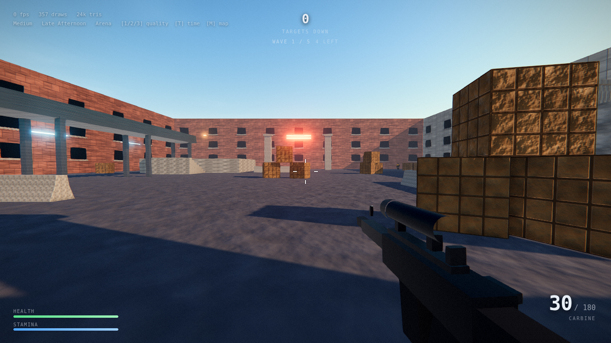

# GTA5mini

瀏覽器內的 three.js 第一人稱射擊原型。**零安裝、零外部資產請求。**

這個 repo 想回答一個具體的問題：

> 在不下載任何 `.exe` 的前提下（純瀏覽器 / 純腳本），畫質天花板到底在哪？

## 結論

**技術上可以做到 GTA5（2013, PS3/Xbox360）等級的渲染，成品上不行。**

GTA5 在 PS3 上是 720p / 30fps，技術是 deferred rendering + cascaded shadow maps + SSAO，
PBR 當時甚至還沒標準化。這套技術現在的 WebGL2 完全跑得動，這個 repo 就是實證。

它看起來震撼的原因不是引擎，是**約 1000 人做了 5 年**堆出來的美術資產量、動畫與關卡調校。
那是內容問題，不是程式問題，換什麼語言或引擎都不會改變。

所以這個原型的取捨是刻意的：**放棄開放世界，把預算全押在單一場景的光照品質上。**
小團隊唯一能在畫面上跟 3A 正面碰撞的方式，就是縮小範圍、提高密度。

## 跑起來

```bash
npm install
npm run dev
```

| 按鍵 | |
|---|---|
| `WASD` | 移動 |
| `Shift` | 衝刺 |
| `Space` | 跳躍 |
| `Ctrl` / `C` | 蹲下 |
| 左鍵 | 射擊（按住連發）|
| 右鍵 | ADS 機瞄 |
| `R` | 換彈 |
| `F` | 手電筒 |
| `1` `2` `3` | 畫質：低 / 中 / 高 |
| `T` | 切換時段（黃昏 / 正午 / 日落）|
| `Esc` | 釋放滑鼠 |

## 單檔打包

```bash
npm run artifact     # 產出 dist-single.html
```

把整個遊戲（含 three.js）內嵌成一個約 0.7 MB 的 HTML，
`file://` 直接開啟即可玩，零網路請求。適合當附件寄出或丟進任何靜態空間。

在無法取得 pointer lock 的環境（iframe 內嵌、部分文件檢視器），
會自動退回「按住滑鼠拖曳轉視角」模式。

## 已經做了什麼

**渲染**
- 完整後處理鏈：GTAO → Bloom → ACES tone mapping → SMAA → 調色（暈影 / 顆粒 / 色差 / 銳化）
- 物理天空 + PMREM 影像式光照（IBL），三組時段預設
- PCF 軟陰影，陰影視錐跟隨玩家
- 三段畫質預設

**玩法**
- FPS 控制器：AABB 碰撞、樓梯 step-up、蹲下、衝刺 / 體力、頭部搖晃、落地下沉
- 武器：視角模型、後座（垂直可學習 + 水平隨機）、彈著散佈、ADS、換彈、槍口火光
- Hitscan + 部位判定（頭 2.4× / 身 1.0× / 肢 0.72×）
- 敵人：blockout 人形、掩體感知的走位、命中反應、死亡 / 重生
- 物件池化的命中特效：曳光彈、彈孔、火花、煙

**工程**
- 固定步長 120 Hz 模擬，與渲染解耦
- 全部貼圖程序生成（tileable fBm + Sobel 法線）
- Headless Chromium 截圖 harness，兼作 smoke test
- 曝光參數掃描工具（讀 `gl.readPixels` 算 luma 分位數）

## 沒有做，而且是刻意的

開放世界串流、多人連線、載具、布娃娃物理。
理由見上面的「結論」——這些會把預算從畫質上抽走。

## 這個場景長怎樣



更多視角在 [`shots/`](./shots)。全部由 `npm run shots` 自動產生。

## 文件

| | |
|---|---|
| [`docs/SPEC.md`](./docs/SPEC.md) | 技術規格：模組邊界、pass 順序、效能預算 |
| [`docs/AI_HANDOFF.md`](./docs/AI_HANDOFF.md) | **怎麼把這個專案發包給 AI agent** |
| [`docs/TASKS.md`](./docs/TASKS.md) | 14 張可直接發包的 ticket |
| [`CLAUDE.md`](./CLAUDE.md) | AI agent 的進入點 |

## 授權

程式碼 MIT。無第三方美術資產——全部程序生成。
